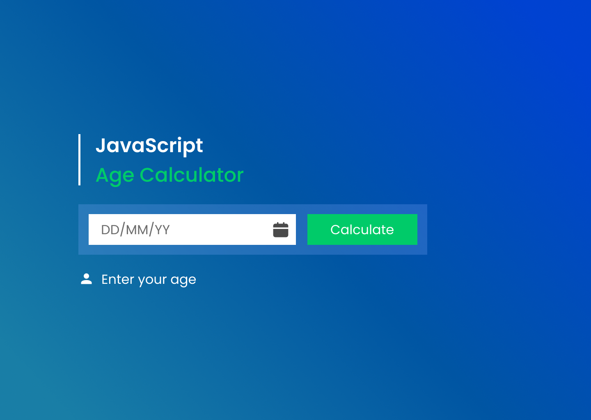

# Age Calculator

An intuitive and simple Age Calculator built using **HTML**, **CSS**, and **JavaScript**, with the design created in **Figma**.

## 🚀 Features

- Enter your birthdate to calculate your exact age in **years**, **months**, and **days**.
- Clear and responsive user interface.
- Real-time calculation with an interactive design.

## 🛠️ Technologies Used

- **Frontend**: HTML, CSS, JavaScript
- **Design**: Figma

## 📸 Preview

## Live Demo  
[**View the Live Project**](https://dark1arrow.github.io/Age-Calculator/)  

## Figma Design  
[**View Figma Design**](https://www.figma.com/design/rervNKegOt7yXEDeSnH9UC/java-script-project?node-id=114-3&t=lH8IOz1TvhuD4lUm-1)  

## LinkedIn Post  
[**Check LinkedIn**](https://www.linkedin.com/in/gouatm-khanna-61ba63262/?utm_source=share&utm_campaign=share_via&utm_content=profile&utm_medium=android_app)
  